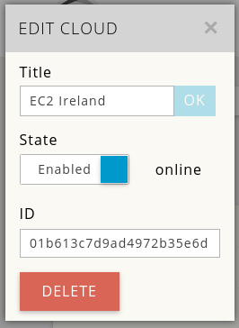
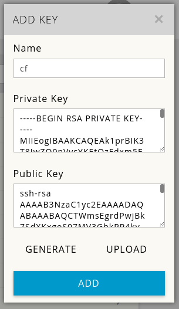

# Mist Cloudify Kubernetes Cluster Example


This repository contains several blueprints for installing a kubernetes cluster through mist.io .<br>
Kubernetes cluster example consists of:

- A kubernetes master
- A kubernetes minion(worker)

Before you begin its recommended you familiarize yourself with
[Cloudify Terminology](http://getcloudify.org/guide/3.1/reference-terminology.html).
You also need [an account on mist.io](https://mist.io/).

This has been succesfully tested on Ubuntu 14.04 and python 2.7

**Note: Documentation about the blueprints content is located inside the blueprint files themselves. Presented here are only instructions on how to RUN the blueprints using the Cloudify CLI with Mist.io plugin .**
<br>
**All commands will assume that the working directory is the root of this repository.**
## Step 1: Install the software

```
git clone https://github.com/mistio/mist-cloudify-example
cd mist-cloudify-example
virtualenv . # create virtualenv
source bin/activate
pip install -r dev-requirements.txt # install dependencies
pip install cloudify https://github.com/mistio/mist.client/archive/cloudify_integration.zip
git clone https://github.com/mistio/cloudify-mist-plugin
cd cloudify-mist-plugin
python setup.py  develop
```

## Step 2: Initialize the environment


You need to add a cloud on your mist.io account. Login to the dashboard (https://mist.kio) and click "ADD CLOUD". In our example we are adding AWS Ireland -instructions on how to add an AWS account can be found on http://docs.mist.io/article/17-adding-amazon-ec2.
Note the ID of the cloud once it is added succesfully, as it will be used on the mist.yaml input file.



<br>

You also need to add an ssh key for mist.io that will be deployed to the machines once they are created. Visit the Keys tab on your mist.io dashboard and generate or upload a key. Note the name, as it will be used on the mist.yaml input file.



<br>

Now enter your account page (https://mist.io/account) and create a token on the API TOKENS tabs.


The kubernetes example scripts are made for a coreos beta image (http://thecloudmarket.com/image/ami-4f4acd3c--coreos-beta-991-2-0) of AWS Ireland and will create c1.medium instances.
There is also support for other linux distribution using the recommended [scripts from kubernetes repo](https://github.com/kubernetes/kubernetes/tree/master/docs/getting-started-guides/docker-multinode)

Check the blueprint file inputs section and fill
the [mist input](inputs/mist.yaml) file with the necessary information.The only fields you have to modify are
<br> `api_token`(create an api_token through the account page on mist.io)
<br> `key_name` (add or create a key on the mist.io)
<br> `cloud_id` (find the cloud_id by clicking on the cloud name on mist.io)
<br> `image_id` (if not deploying on AWS Ireland you'll have to change the image_id to a coreos image on the provider you want to deploy)
Then run:

`cfy local init -p mist-blueprint.yaml -i inputs/mist.yaml` <br>

This command (as the name suggests) initializes your working directory to work with the given blueprint.

The output would be something like this:

```
(mist-cloudify-example)user@user:~/Desktop/mist-cloudify-example$ cfy local init -p mist-blueprint.yaml -i inputs/mist.yaml
Processing Inputs Source: inputs/mist.yaml
Initiated mist-blueprint.yaml
If you make changes to the blueprint, run 'cfy local init -p mist-blueprint.yaml' again to apply them
```
Now, you can run any type of workflows on this blueprint. <br>

## Step 2: Install a kubernetes cluster

You are now ready to run the `install` workflow: <br>

`cfy local execute -w install`

This command will install the kubernetes master and a kubernetes minion.

The output should be something like that: <br>

```
(mist-cloudify-example)user@user:~/Desktop/mist-cloudify-example$ cfy local execute -w install
2016-05-07 22:55:14 CFY <local> Starting 'install' workflow execution
2016-05-07 22:55:14 CFY <local> [master_db493] Creating node
2016-05-07 22:55:14 CFY <local> [key_7c759] Creating node
2016-05-07 22:55:14 CFY <local> [master_db493.create] Sending task 'plugin.kubernetes.create'
2016-05-07 22:55:14 CFY <local> [key_7c759.create] Sending task 'plugin.keypair.create'
...
```

You can visit [mist.io machines page](https://mist.io/#/machines) to see the machines GigaDemoMaster and GigaDemoFirstWorker have been created and click on them to view the logs if the scripts are running.

<br>
You can view the public ip of the kubernetes master on Basic Info  section of the master machine page.

## Step 3: Scale cluster
To scale the cluster up  first edit the `inputs/new_worker.yaml` file with the proper inputs. Edit the `delta` parameter to specify the number of machines to be added to the cluster. Other input fields are the same as the inputs given on initialization. Then run :
`cfy local execute -w scale_cluster_up -p inputs/new_worker.yaml `

To scale the cluster down edit the `inputs/remove_worker.yaml` file and specify the delta parameter as to how many machines should be removed(destroyed) from the cluster and then run:
`cfy local execute -w scale_cluster_down -p inputs/remove_worker.yaml `

## Step 4: Uninstall

To uninstall the kubernetes cluster and destroy all the machines we run the `uninstall` workflow : <br>

`cfy local execute -w uninstall`

Example output will be something like:

```
(mist-cloudify-example)user@user:~/unweb/mist-cloudify-example$ cfy local execute -w uninstall
2016-05-07 23:40:31 CFY <local> Starting 'uninstall' workflow execution
...
2016-05-07 23:41:20 LOG <local> [master_db493.delete] INFO: Machine destroyed
2016-05-07 23:41:20 CFY <local> [master_db493.delete] Task succeeded 'plugin.server.delete'
```